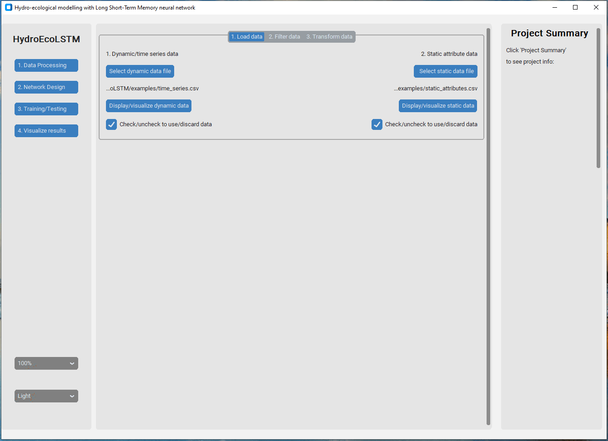

# HydroEcoLSTM

```python
# Install the package from github
pip install git+https://github.com/tamnva/hydroecolstm.git

# Import the package
import hydroecolstm

# Show the graphical user interface
hydroecolstm.interface.show_gui()

# Example of static and dynamic data in this folder
# static data (catchment attributes) 'examples/static_attributes.csv'
# dynamic data (time series input and target features) 'examples/time_series.csv'

# Example running without user interface
# 'examples/main_script.py' and the configuration file 'examples/config.yml'

```

<p align="center">
  
</p>
